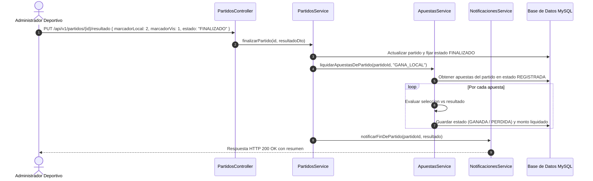

# Componentes y Flujos de Negocio (Participante B)

## 1. Diagrama de Módulos y Relaciones

```mermaid
graph TD
    subgraph Modulos_Participante_B
        Partidos[PartidosModule]
        Anotaciones[AnotacionesModule]
        Pelotas[PelotasModule]
        Posiciones[PosicionesEspacialesModule]
        HabilidadesJugador[HabilidadesJugadorModule]
        Localidades[LocalidadesModule]
        Boletos[BoletosModule]
        Aficionados[AficionadosModule]
        AficionadoEquipo[AficionadoEquipoModule]
        MetodosPagoAficionado[MetodosPagoAficionadoModule]
        Apuestas[ApuestasModule]
    end

    subgraph Dependencias_A
        EquipoStub[Equipo]
        FaseStub[Fase / Torneo]
        JugadorStub[Jugador]
        EscenarioStub[Escenario]
    end

    subgraph Dependencias_C
        HabilidadStub[Habilidad]
        MetodoPagoStub[Método Pago Catálogo]
    end

    Partidos --> FaseStub
    Partidos --> EscenarioStub
    Partidos --> EquipoStub
    Partidos --> Pelotas

    Anotaciones --> Partidos
    Anotaciones --> JugadorStub

    Posiciones --> Partidos
    Posiciones --> JugadorStub
    Posiciones --> Pelotas

    Boletos --> Partidos
    Boletos --> Aficionados
    Boletos --> Localidades
    Localidades --> EscenarioStub

    Apuestas --> Partidos
    Apuestas --> Aficionados
    Apuestas --> MetodosPagoAficionado
    MetodosPagoAficionado --> MetodoPagoStub

    HabilidadesJugador --> JugadorStub
    HabilidadesJugador --> HabilidadStub
```

## 2. Flujo de Finalización de Partido y Liquidación de Apuestas

```mermaid
sequenceDiagram
    autonumber
    actor Admin as Administrador Deportivo
    participant PC as PartidosController
    participant PS as PartidosService
    participant AS as ApuestasService
    participant NS as NotificacionesService
    participant DB as Base de Datos MySQL

    Admin->>PC: PUT /api/v1/partidos/{id}/resultado { marcadorLocal: 2, marcadorVis: 1, estado: "FINALIZADO" }
    PC->>PS: finalizarPartido(id, resultadoDto)
    PS->>DB: Actualizar partido y fijar estado FINALIZADO
    PS->>AS: liquidarApuestasDePartido(partidoId, "GANA_LOCAL")
    AS->>DB: Obtener apuestas del partido en estado REGISTRADA
    loop Por cada apuesta
        AS->>AS: Evaluar seleccion vs resultado
        AS->>DB: Guardar estado (GANADA / PERDIDA) y monto liquidado
    end
    PS->>NS: notificarFinDePartido(partidoId, resultado)
    NS-->>Admin: Respuesta HTTP 200 OK con resumen
```
